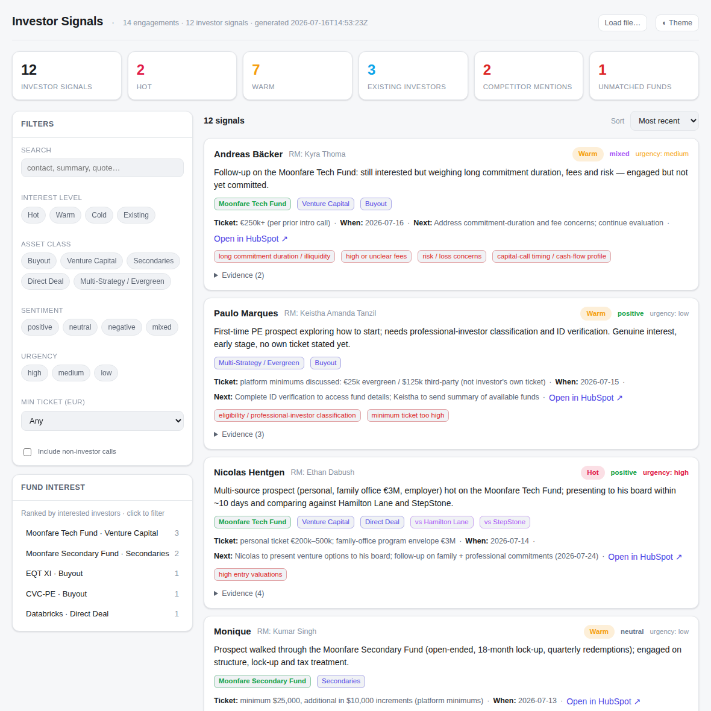

# Investor Signals

An internal app + pipeline that turns Moonfare's HubSpot conversations into a
**structured, queryable view of investor interest** for the sales team — which
funds prospects are asking about, sentiment, pain points, ticket size and
urgency — with fund names normalized against a canonical list.

**Read-only against HubSpot. No CRM writes.** The pipeline reads engagements and
writes only to this repo (a local JSONL store + a static app bundle).

```
investor-signals/
├─ app/
│  ├─ index.html      ← the internal query app (open in any browser)
│  └─ data.js         ← generated data bundle the app reads (window.__STORE__)
├─ store/
│  ├─ signals.jsonl   ← the local store: one investor-signal record per engagement
│  └─ schema.json     ← JSON Schema for a signal record
├─ funds.json         ← canonical fund list + aliases + competitors + brand fixups
├─ taxonomy.json      ← controlled vocab (asset classes, sentiment, urgency, …)
└─ scripts/
   ├─ normalize_funds.py   ← deterministic fund-name normalization (+ self-test)
   └─ build_store.py       ← validate the store + (re)generate app/data.js
```

The extraction pipeline itself is the Claude Code skill
[`investor-signals-extraction`](../.claude/skills/investor-signals-extraction/SKILL.md).

## Open the app

It's a static, dependency-free page — just open it:

```
open investor-signals/app/index.html        # macOS
xdg-open investor-signals/app/index.html     # Linux
```

It loads `app/data.js` directly (works from `file://`, no server). If you have a
raw `store/signals.jsonl` from elsewhere, use the **Load file…** button. The app
gives you KPI tiles, a **fund-interest ranking**, full-text search, and filters by
interest level, asset class, sentiment, urgency, fund and minimum ticket. Each
card links back to the engagement in HubSpot. Non-investor calls (device tests,
internal, recruitment) are classified out and hidden by default.



## Run / refresh the extraction

Ask Claude Code (with the HubSpot + Notion connectors enabled), e.g.
*"run the investor signals extraction for the last 14 days"* — it invokes the
skill, which:

1. reads recent calls (`hs_call_summary`) and emails from HubSpot (read-only);
2. classifies each conversation and extracts a structured signal
   (sentiment, asset classes, pain points, ticket, urgency, next step);
3. normalizes fund mentions against `funds.json` (handles the "Moonfair"/
   "Moonsphere" → Moonfare transcription quirk and fund aliases);
4. upserts records into `store/signals.jsonl` (dedup by engagement);
5. validates and regenerates `app/data.js`.

### Rebuild the bundle after editing the store by hand
```
python3 investor-signals/scripts/build_store.py          # validate + rebuild data.js
python3 investor-signals/scripts/build_store.py --check  # validate only
python3 investor-signals/scripts/normalize_funds.py --test
```

## Canonical funds

`funds.json` is seeded from the Notion **Fund Launch Pipeline Tracker**
(`Target Fund Name`) plus Moonfare's proprietary products (Tech Fund, Secondary
Fund, Mid-Market Fund) and observed transcript variants. The skill can refresh
third-party funds from Notion on each run; hand-curated aliases, competitors and
the brand-fixup rules are preserved.

## Data & privacy

Records contain investor names and interest details derived from CRM
conversations. The store lives in this repo — treat it as internal. The app is a
local file (not published) and makes no network calls. Nothing is written back to
HubSpot.
